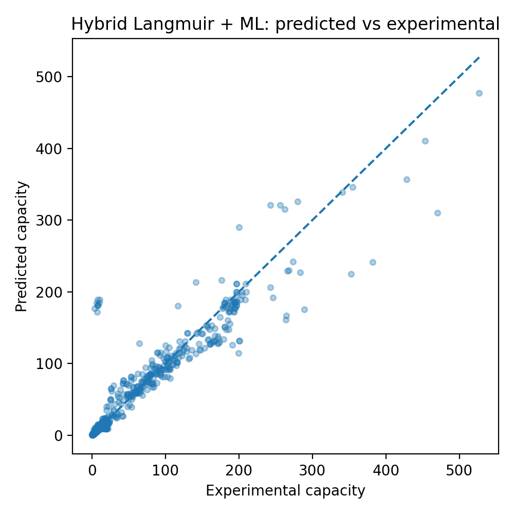
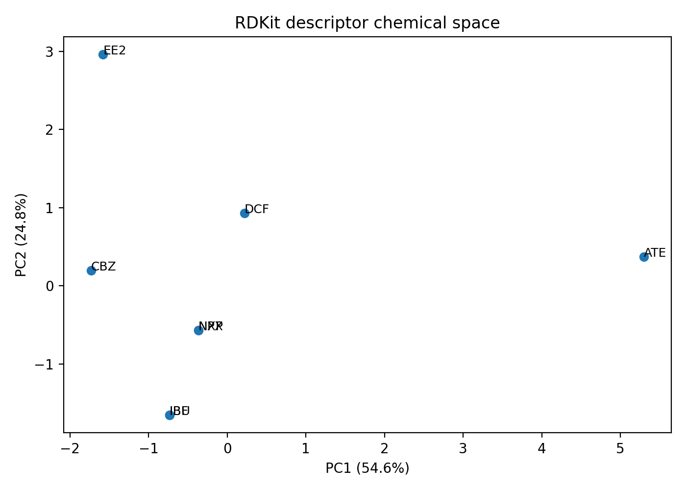
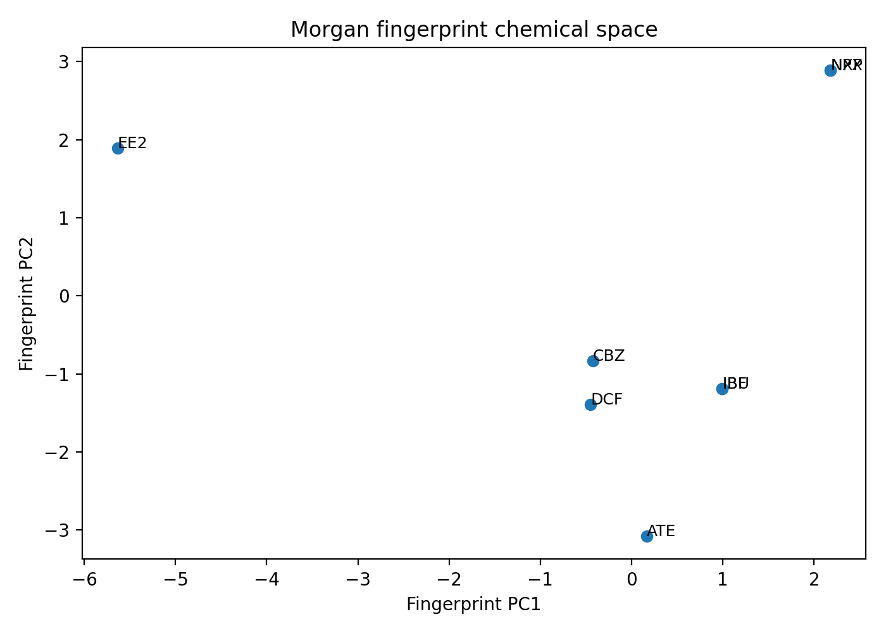
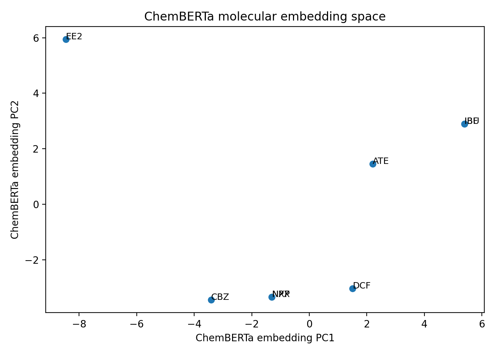

# Adsorption Performance Predictor & Adsorbent Selector

This project is a **cheminformatics and chemical data science workflow** for adsorption-based removal of organic water contaminants (pharmaceuticals, herbicides, fungicides, dyes, etc.).

It combines:
- real experimental adsorption data (~3,700 records)
- molecular representations (RDKit descriptors, fingerprints, ChemBERTa embeddings)
- physics-informed feature engineering
- a **hybrid Langmuir + machine learning model**
- an interactive Streamlit app for research support

---

## 🔬 Problem

Given:
- pollutant (structure or descriptors)
- adsorbent properties (biochar composition, surface area, pore structure)
- adsorption conditions (pH, dosage, time, temperature)

Predict:
- **adsorption capacity (mg/g)**

and support:
- **adsorbent design and condition optimization**

---

## 📊 Dataset

Primary dataset:
`data/raw/ec_biochar_adsorption_raw.csv` :contentReference[oaicite:0]{index=0}

- ~3,757 experimental data points
- ~24 variables
- Includes:
  - adsorption conditions
  - biochar properties
  - elemental composition
  - experimental adsorption capacity

### ⚠️ Real-world characteristics

- heterogeneous sources
- varying experimental conditions
- partial missing data (SMILES coverage ~0.76)

👉 This reflects **real industrial chemical data**, not curated benchmarks.

---

## 🧠 Generalizable Molecular Descriptor Framework

A key strength of this project is the use of **structure-derived molecular descriptors**, including:

- logP (hydrophobicity)
- TPSA (polarity)
- HBD / HBA (hydrogen bonding)
- molecular weight
- ring count

These descriptors are:

✔ computed from structure (SMILES or manual input)
✔ independent of specific datasets
✔ applicable to **any organic pollutant**

👉 This enables the model and app to:
- evaluate new contaminants not in the dataset
- support exploratory chemical screening
- generalize beyond fixed pollutant lists

---

## 🧪 Cheminformatics & Data Pipeline

This project implements a modular workflow:

### 1. Data processing
- cleaning and validation of experimental data
- handling missing and inconsistent values

### 2. Molecular representation
- RDKit descriptors (interpretable)
- Morgan fingerprints (structural similarity)
- ChemBERTa embeddings (learned representations)

### 3. Feature engineering
- concentration-to-dosage ratio (C/dosage)
- log transformations
- time-to-dosage interactions

👉 This combines **domain knowledge + ML-ready features**

---

## ⚙️ Modeling Approach

### Models evaluated:
- Random Forest
- HistGradientBoosting
- SVR (RBF kernel)
- Kernel Ridge

### Key finding:

- tree models → step-like, non-physical behavior
- kernel ridge → unstable curvature
- **SVR → smooth and physically consistent trends**

👉 SVR was selected for hybrid modeling.

---

## 🔬 Hybrid Langmuir + ML Model

Final model integrates machine learning with adsorption physics:

\[
q = \frac{q_{max} K C}{1 + K C}
\]

Where:
- ML predicts **qmax** (capacity limit)
- ML predicts **K** (adsorption affinity)

### Advantages:
- smooth monotonic increase
- realistic saturation behavior
- avoids plateau/decrease artifacts

---

## 📈 Model Performance

| Model | MAE | R² |
|------|-----|----|
| Hybrid (qmax only) | ~10.4 | ~0.84 |
| Hybrid (qmax + K) | **~9.9** | **~0.88** |

- strong agreement with experiments
- R² ≈ **0.88**
- robust across wide capacity range
---

## 📊 Key Insights

### Feature engineering
- capacity correlates more strongly with **C/dosage** than concentration alone

### Chemical space
- RDKit PCA → physicochemical similarity
- fingerprints → structural similarity
- ChemBERTa → learned relationships

- captures physicochemical properties
- separates molecules by polarity & size

- captures structural similarity
- clusters similar compounds

- learned chemical representation
- captures deeper molecular relationships

### Model behavior
- hybrid model preserves physical adsorption trends
- sensitivity analysis shows realistic saturation

- smooth increase
- realistic saturation
- consistent with adsorption physics

- smooth increase
- realistic saturation
- consistent with adsorption physics
---

## 🧱 Unstructured Data Handling

A prototype parser demonstrates how **semi-structured chemical records** can be converted into structured features.

👉 This simulates real workflows where data comes from:
- reports
- industrial systems
- regulatory text

---

## 🚀 Streamlit App: Research Tool

The application is designed as a **research support tool**, not just a predictor.

Users can:
- input pollutant descriptors (manual or SMILES-based)
- modify adsorbent properties (surface area, composition)
- adjust experimental conditions

### Goal:

> **Explore how changes in biochar properties and conditions affect adsorption capacity**

👉 This helps researchers:
- design better adsorbents
- test hypotheses
- guide experiments

---

## 🧠 Adsorption Recommendation Logic

The app provides chemistry-informed guidance based on:

- hydrophobicity (logP)
- polarity (TPSA)
- aromaticity (π–π interactions)
- surface area and pore structure
- adsorption conditions

👉 Intended as **screening support**, not a replacement for experiments.

---

## 🔍 Applicability Domain

Model reliability is constrained by:

- training feature ranges
- chemical space coverage

👉 Input constraints prevent unreliable extrapolation.

---

## ⚠️ Limitations

- incomplete SMILES coverage (~76%)
- heterogeneous experimental data
- Langmuir assumption may not hold for all systems
- reduced accuracy at extreme values

---

## 📚 Future Work

- full ChemBERTa integration into model
- pKa / pHpzc incorporation
- multi-component adsorption
- improved SMILES coverage (PubChem mapping)
- integration with chemical databases

---

## 💼 Relevance for Chemical Data Science

This project demonstrates:

- chemical data pipeline design
- molecular representation (RDKit + embeddings)
- physics-informed feature engineering
- hybrid ML + scientific modeling
- interpretability and domain awareness

---
